# Canterbury Guided Tours

## Digital Platform Proposal

### Public Website and Admin Operations System

Prepared for stakeholder review and PDF presentation

**Document Date:** 6 May 2026  
**Version:** 1.1  
**Prepared For:** Canterbury Guided Tours

---

This proposal presents the current Canterbury Guided Tours platform as a combined customer-facing website and secure internal management system. It includes visual page references, operational workflows, and technical appendices to support review, sign-off, and future development planning.

All page screenshots referenced in this document have been refreshed to reflect the current site theme and navigation styling.

<div style="page-break-after: always;"></div>

## Contents

1. [Proposal Summary](#proposal-summary)
2. [Project Objectives](#project-objectives)
3. [What This Platform Delivers](#what-this-platform-delivers)
4. [Customer-Facing Experience](#1-customer-facing-experience)
5. [Admin and Operations Platform](#2-admin-and-operations-platform-admin)
6. [Appendix A: Database Models and Relationships](#appendix-a-database-models-and-relationships)
7. [Appendix B: API Endpoints](#appendix-b-api-endpoints)
8. [Appendix C: Authentication and Security](#appendix-c-authentication-and-security)
9. [Appendix D: Technology Stack](#appendix-d-technology-stack)
10. [Appendix E: Key Features and Business Logic](#appendix-e-key-features-and-business-logic)
11. [Appendix F: Future Enhancement Opportunities](#appendix-f-future-enhancement-opportunities)
12. [Appendix G: Deployment Considerations](#appendix-g-deployment-considerations)
13. [Closing Summary](#closing-summary)

<div style="page-break-after: always;"></div>

## Proposal Summary

This document presents the Canterbury Guided Tours digital platform as a complete customer-facing website and internal operations system. It is written to support client review, stakeholder sign-off, and PDF presentation.

The platform is made up of two connected parts:
- **Public Website**: A polished marketing and booking experience for visitors, schools, and private groups.
- **Admin System**: A secure back-office workspace for managing bookings, guides, availability, invoices, and reporting.

The main body of this proposal is intentionally written in plain English and supported by live screenshots from the current build. Detailed technical reference material is included later as appendices.

## Project Objectives

- Present Canterbury Guided Tours as a premium, professional visitor experience.
- Convert website visitors into daily tour bookings and group enquiries.
- Give staff a clear operational system for managing customers, guides, and schedules.
- Create a scalable foundation for future features such as payments, notifications, and advanced reporting.

## What This Platform Delivers

- A responsive public website with clear calls to action and streamlined booking journeys.
- Distinct journeys for daily tours, private groups, and general contact enquiries.
- A secure admin area with live operational data and structured workflow management.
- A single source of truth for clients, bookings, guides, rotas, invoices, and reports.

---

## 1. Customer-Facing Experience

The public website is designed to do two things well: build confidence in the brand and convert interest into bookings. Each page has a clear role in the customer journey, from discovery through to enquiry or confirmed reservation.

### 1. Home Page (`/`)
**Purpose**: Welcome landing page showcasing the company

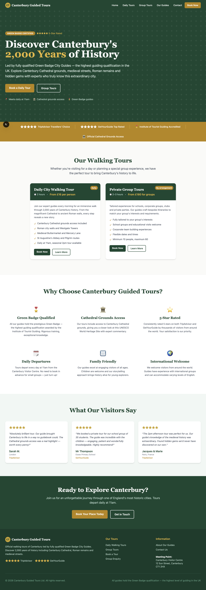

**Key Components**:
- Hero section with call-to-action buttons
- Tour highlights and featured experiences  
- Customer testimonials with 5-star ratings
- Navigation to tour details and booking pages
- Footer with company information and links

**Functionality**:
- Responsive design for mobile, tablet, and desktop
- Direct links to booking pages
- Contact information display

**Tech Stack**: React components, Tailwind CSS, responsive layout

---

### 2. About Page (`/about`)
**Purpose**: Information about the company and tour guides

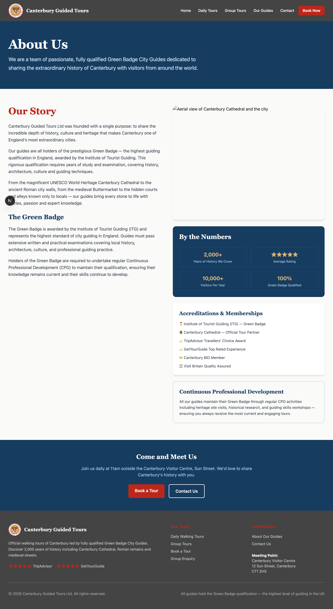

**Key Components**:
- Company mission and history
- Guide profile section showcasing Green Badge qualified guides
- Guide expertise and background
- Company credentials and certifications

**Functionality**:
- Display guide profiles with bio information
- Show professional qualifications (Green Badge status)
- Contact details for guide team

**Backend Integration**: 
- Fetches Guide data from Prisma database
- Displays `firstName`, `lastName`, `email`, `phone`, `bio`, `badgeNumber`

---

### 3. Tours Page - Daily Tours (`/tours/daily`)
**Purpose**: Marketing page for daily walking tours

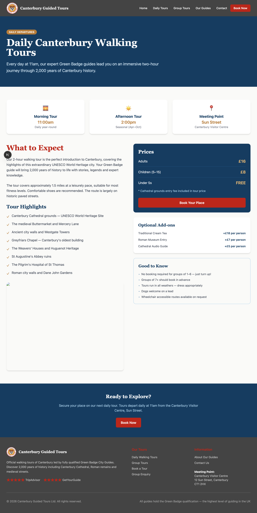

**Key Components**:
- Tour overview and itinerary
- Duration, price, and meeting point details
- Key highlights of the route
- Customer testimonials
- Book Now button

**Functionality**:
- Displays tour information from database
- Shows pricing (adult and child rates)
- Maximum group capacity
- Meeting point location

**Backend Integration**:
- Fetches Tour model with `type: "daily"`
- Shows fields: `name`, `description`, `price`, `childPrice`, `maxCapacity`, `meetingPoint`, `duration`

---

### 4. Tours Page - Group Tours (`/tours/group`)
**Purpose**: Marketing page for private group and corporate tours

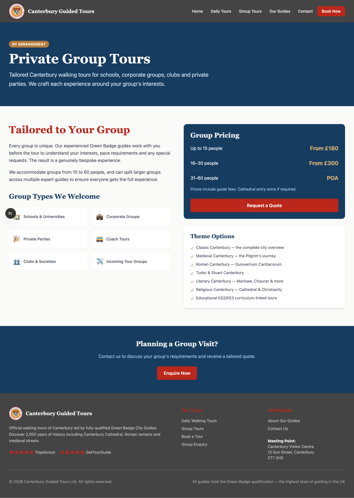

**Key Components**:
- Group tour packages and customization options
- Pricing for different group types (schools, corporate, family)
- Booking inquiry form
- Available themes and add-ons
- Professional references and previous corporate clients

**Functionality**:
- Displays group tour options
- Shows theme customization options
- Displays upsell products (additional experiences)
- Links to group booking inquiry form

**Backend Integration**:
- Fetches Tour model with `type: "group"`
- Shows associated Upsell products
- Pricing varies by group size and requirements

---

### 5. Daily Booking Page (`/book/daily`)
**Purpose**: Online booking form for daily walking tours

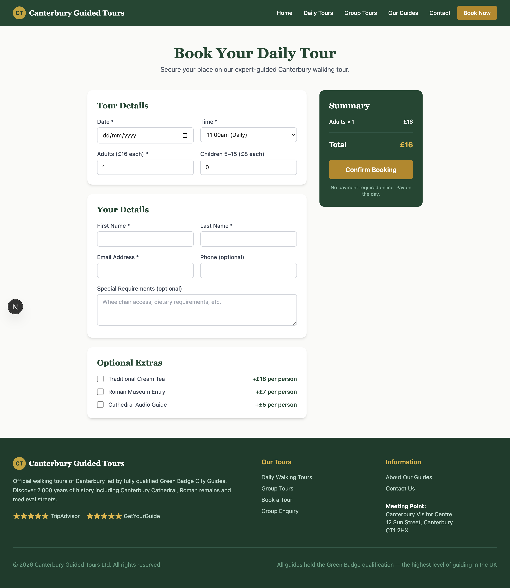

**Key Components**:
- Tour selection dropdown
- Date picker (future dates only)
- Time slot selection
- Adult and children guest count
- Contact information form
- Price calculator
- Submit booking button

**Form Fields**:
- Tour selection
- Tour date (DateTime)
- Time slot selection
- Number of adults (Int)
- Number of children (Int, default 0)
- Client first name
- Client last name
- Client email
- Client phone number
- Optional booking notes

**Functionality**:
- Real-time price calculation based on guests and tour type
- Date validation (no past dates)
- Time slot availability checking
- Form validation with React Hook Form + Zod
- Creates Client and DailyBooking records

**Backend Integration**:
- POST `/api/bookings/daily`
- Creates Client record if new
- Creates DailyBooking record
- Calculates total amount: `(adults × price) + (children × childPrice)`
- Status defaults to "CONFIRMED"

**API Endpoint**: `/src/app/api/bookings/daily/route.ts`

---

### 6. Group Booking Page (`/book/group`)
**Purpose**: Inquiry form for group and corporate tours

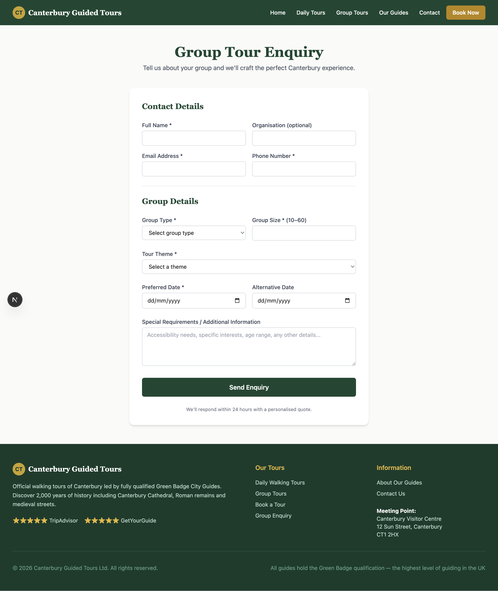

**Key Components**:
- Organisation name field
- Group size input
- Preferred date and alternative date pickers
- Tour theme selection
- Group type dropdown (school, corporate, family, other)
- Special requirements textarea
- Contact information form
- Submit inquiry button

**Form Fields**:
- Organisation/school name
- Group type (school, corporate, family, wedding)
- Group size (Int)
- Preferred tour date
- Alternative tour date
- Tour theme (historical, food-focused, architectural)
- Special requirements and accessibility needs
- Client contact information

**Functionality**:
- Form validation
- Creates GroupBooking record with status "ENQUIRY"
- Admin receives inquiry for follow-up
- Confirmation email sent to client

**Backend Integration**:
- POST `/api/bookings/group`
- Creates Client record
- Creates GroupBooking record
- Status: "ENQUIRY" (admin will update to "CONFIRMED" or "CANCELLED")

**API Endpoint**: `/src/app/api/bookings/group/route.ts`

---

### 7. Contact Page (`/contact`)
**Purpose**: Contact form for general inquiries

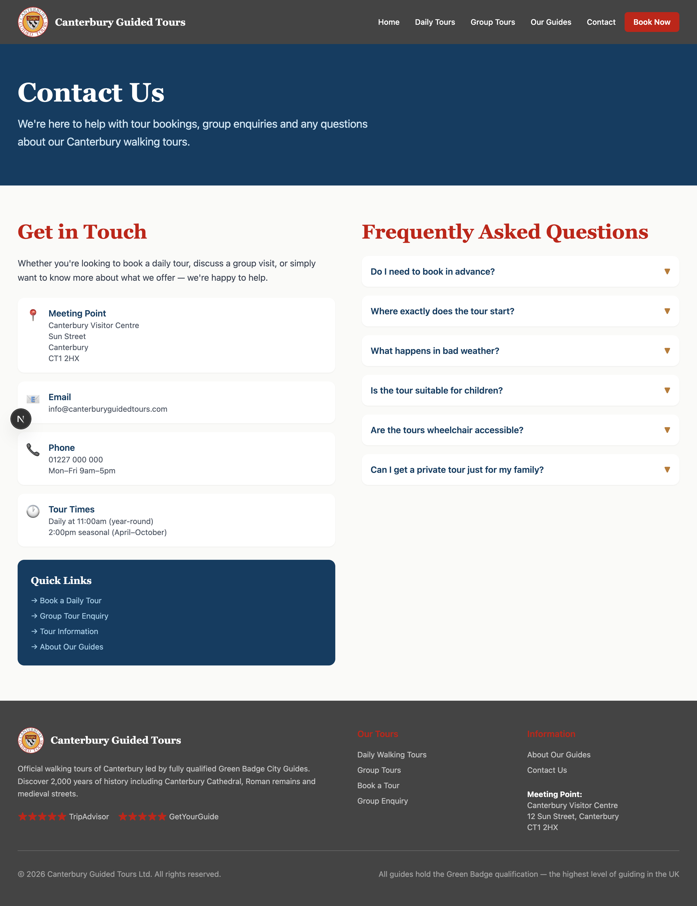

**Key Components**:
- Name field
- Email field
- Subject line
- Message textarea
- Submit button
- Contact information display
- Meeting point address

**Functionality**:
- Form validation
- Sends email to admin
- Displays business hours and location
- Phone number and email address displayed

---

## 2. Admin and Operations Platform (`/admin`)

The admin system is the operational backbone of the platform. It gives the business a practical internal workspace for day-to-day management, while keeping customer data, guide scheduling, and financial visibility in one place.

### Authentication & Access Control
- **Login URL**: `/login`
- **Auth Method**: NextAuth v5 with credentials provider (email + password)
- **Session Type**: JWT (stateless)
- **Protected Routes**: All `/admin/**` routes require valid session
- **Database**: Credentials verified against User model with bcrypt hashing

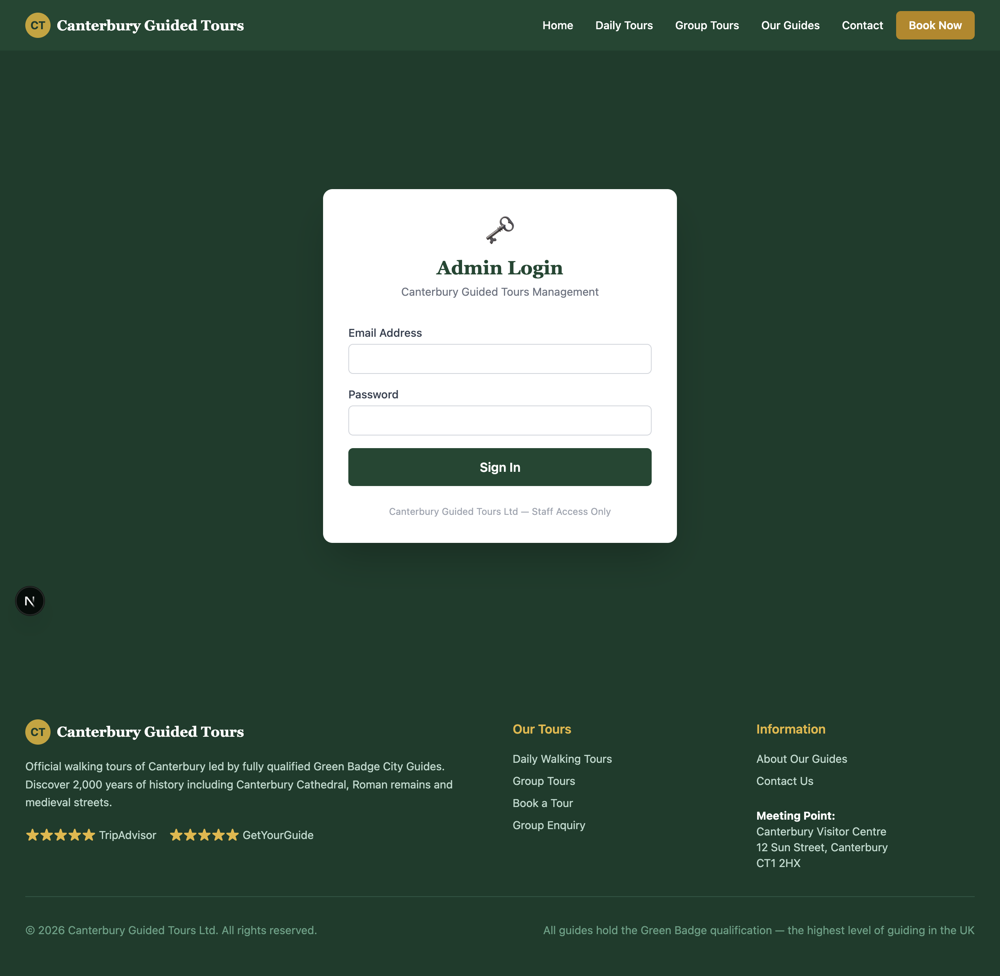

**Admin Login Credentials** (Development):
- Email: `admin@canterburyguidedtours.com`
- Password: `admin123`

---

### Admin Dashboard (`/admin`)
**Purpose**: Overview of key business metrics

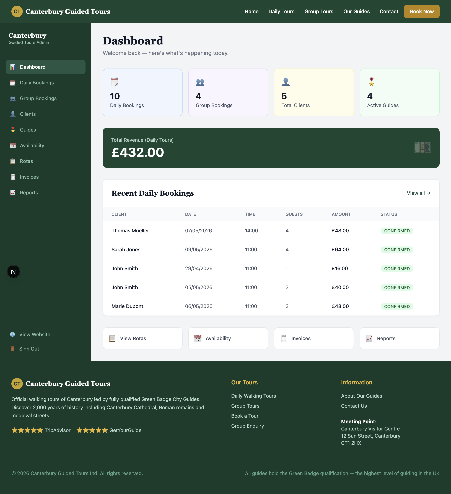

**Displays**:
- **Daily Bookings Count**: Total number of daily tour bookings
- **Group Bookings Count**: Total number of group enquiries/bookings
- **Total Clients**: Unique customer count
- **Active Guides**: Number of guides marked as `isActive: true`
- **Total Revenue**: Sum of `totalAmount` from all DailyBooking records

**Key Metrics**:
```
Revenue = SUM(DailyBooking.totalAmount)
```

**Recent Bookings Table**:
- Shows 5 most recent daily bookings
- Displays: Client name, tour date, time slot, guest count, amount, status
- Color-coded status badges (Green: CONFIRMED)

**Quick Access Links**:
- View Rotas
- Manage Availability
- Create Invoices
- View Reports

---

### Daily Bookings Management (`/admin/bookings/daily`)
**Purpose**: Create and manage individual tour bookings

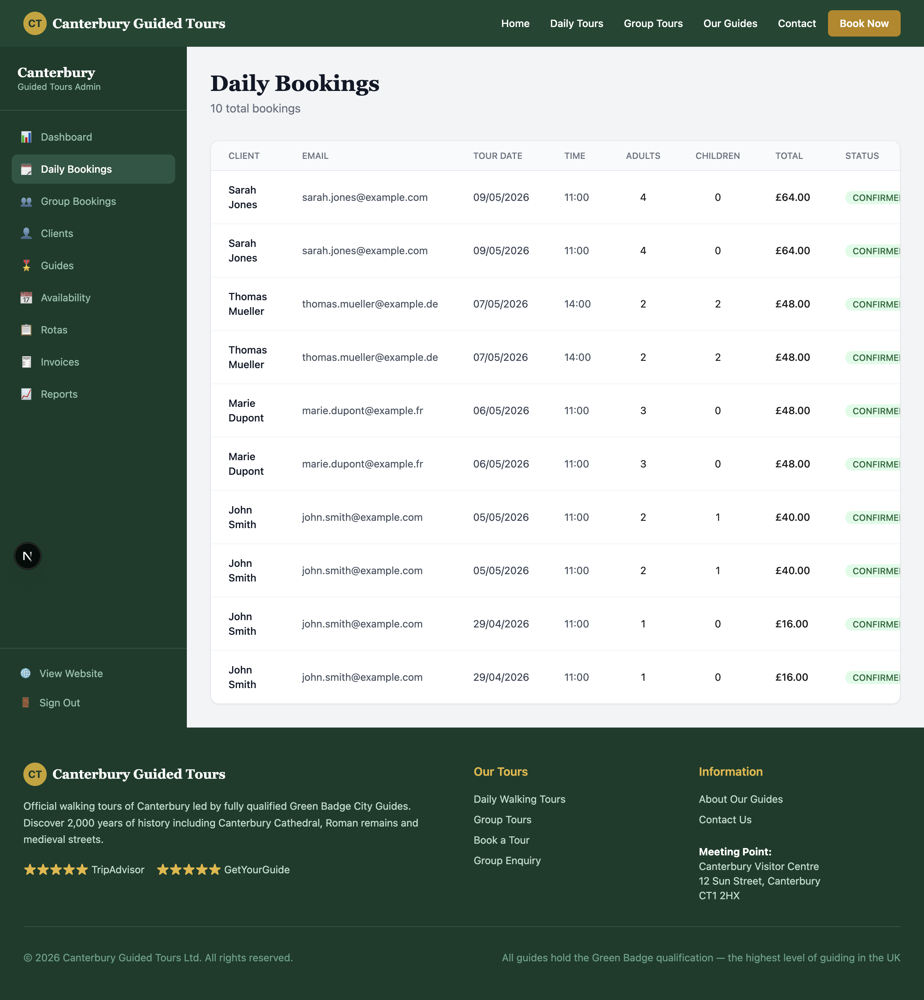

**Features**:
- **View All Bookings**: Table with columns:
  - Client name
  - Tour date and time
  - Number of adults/children
  - Total amount
  - Booking status
  - Action buttons (edit, view details, cancel)

- **Create New Booking**: 
  - Search/select existing client or create new
  - Select tour
  - Pick date and time slot
  - Enter guest counts
  - Auto-calculate total price
  - Add optional notes

- **Edit Booking**:
  - Modify guest counts
  - Change date/time if available
  - Update status (CONFIRMED, CANCELLED)
  - Update notes

- **Booking Status Tracking**:
  - CONFIRMED: Booking is active
  - CANCELLED: Booking is cancelled
  - Can track customer communications in notes

**Database Model**:
```
DailyBooking {
  id: String
  clientId: String (FK)
  client: Client (relation)
  tourDate: DateTime
  timeSlot: String
  adults: Int
  children: Int (default 0)
  totalAmount: Float
  status: String (default "CONFIRMED")
  notes: String?
  createdAt: DateTime
  updatedAt: DateTime
  rotaEntries: RotaEntry[] (relation)
}
```

---

### Group Bookings Management (`/admin/bookings/group`)
**Purpose**: Manage corporate, school, and group tour inquiries

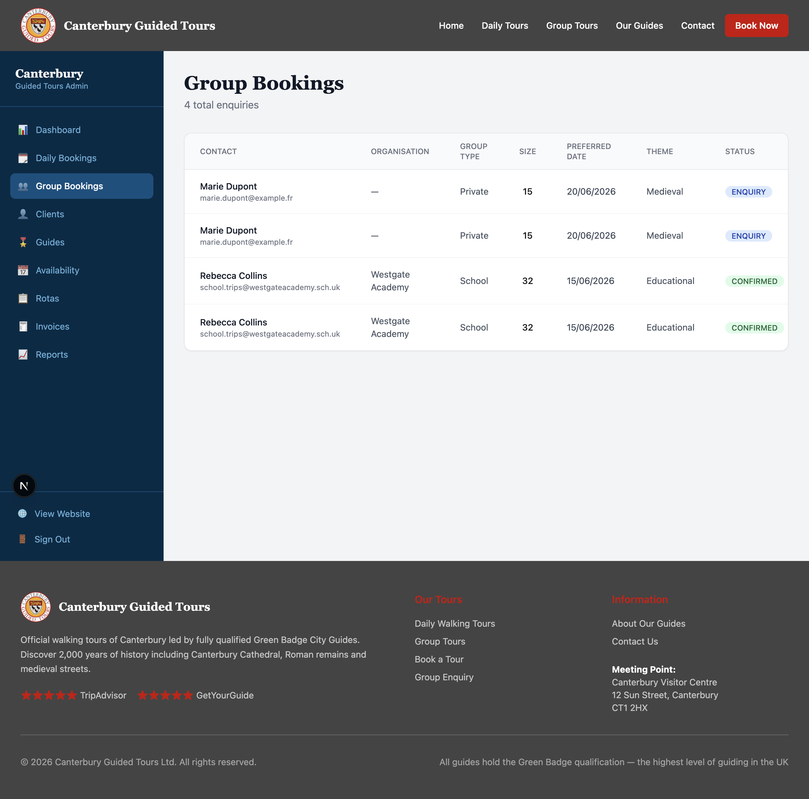

**Features**:
- **View All Inquiries**: Table with:
  - Organisation name
  - Group size
  - Preferred date
  - Tour theme
  - Inquiry status
  - Client contact info

- **Track Inquiry Status**:
  - ENQUIRY: Initial inquiry received
  - CONFIRMED: Booking confirmed with client
  - CANCELLED: Booking cancelled
  - COMPLETED: Tour completed

- **Follow-up Actions**:
  - Send quote/proposal
  - Schedule call with client
  - Assign dedicated account manager
  - Add internal notes

- **Booking Details**:
  - View alternative dates offered
  - Special requirements and accessibility needs
  - Custom group theme preferences
  - Price customization per group

**Database Model**:
```
GroupBooking {
  id: String
  clientId: String (FK)
  client: Client (relation)
  organisation: String?
  groupSize: Int
  preferredDate: DateTime
  alternativeDate: DateTime?
  tourTheme: String?
  groupType: String? (school, corporate, family)
  requirements: String?
  status: String (default "ENQUIRY")
  createdAt: DateTime
  updatedAt: DateTime
}
```

---

### Clients CRM (`/admin/clients`)
**Purpose**: Manage customer relationship data

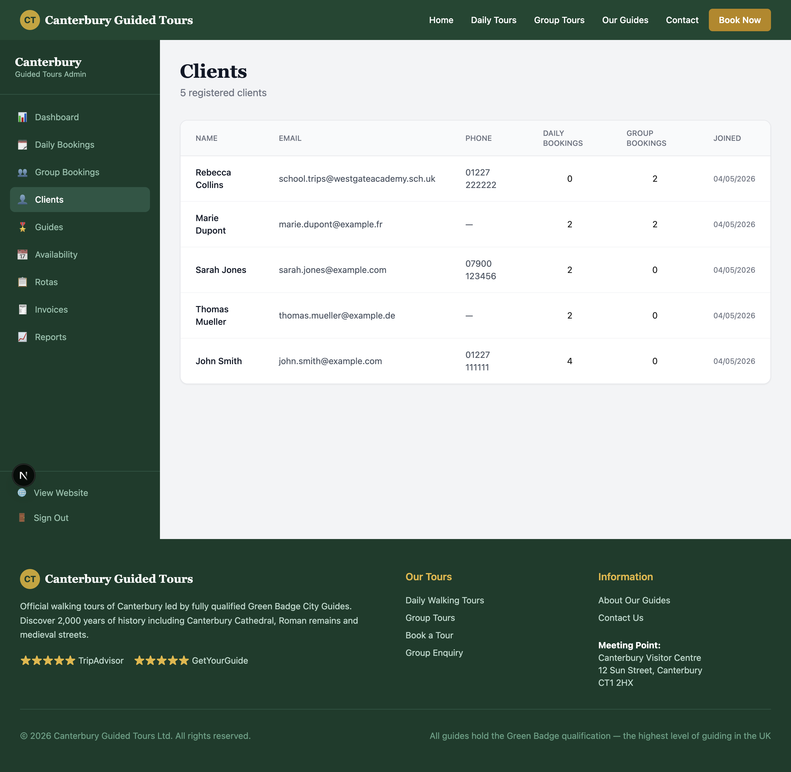

**Features**:
- **Client Database**: All customers in one place
- **Client Profile**:
  - First and last name
  - Email address
  - Phone number
  - Organisation (if applicable)
  - Country
  - Internal notes
  - Customer since date

- **Booking History**: View all bookings and inquiries for each client
  - Daily tours booked
  - Group inquiries submitted
  - Total spent
  - Last booking date

- **Add New Client**: Manual client creation for phone/walk-in bookings

- **Edit Client**: Update contact information and notes

- **Search/Filter**: Find clients by name, email, or organisation

**Database Model**:
```
Client {
  id: String
  firstName: String
  lastName: String
  email: String (unique)
  phone: String?
  organisation: String?
  country: String?
  notes: String?
  createdAt: DateTime
  updatedAt: DateTime
  dailyBookings: DailyBooking[] (relation)
  groupBookings: GroupBooking[] (relation)
}
```

---

### Guides Management (`/admin/guides`)
**Purpose**: Manage tour guide profiles and qualifications

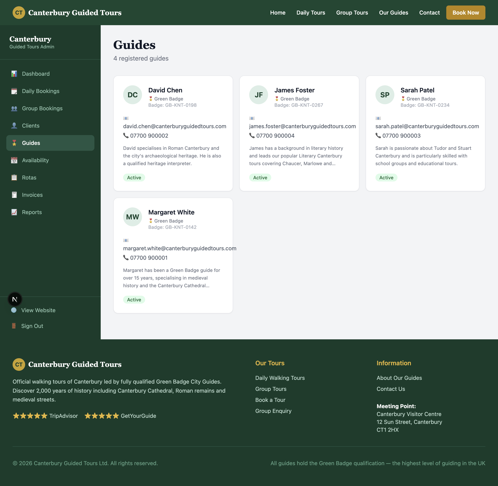

**Features**:
- **Guide Directory**:
  - First and last name
  - Email and phone contact
  - Green Badge number (qualification verification)
  - Professional bio
  - Active status

- **Guide Profile**:
  - Biographical information
  - Specializations and expertise areas
  - Languages spoken
  - CPD (Continuing Professional Development) records
  - Availability calendar

- **CPD Tracking**:
  - Record professional development courses
  - Track CPD provider and date
  - Record training costs
  - Status: booked, completed, cancelled

- **Active/Inactive Status**:
  - Mark guides as active (available for bookings)
  - Deactivate guides (retired, on leave)

**Database Model**:
```
Guide {
  id: String
  firstName: String
  lastName: String
  email: String (unique)
  phone: String?
  bio: String?
  badgeNumber: String?
  isActive: Boolean (default true)
  createdAt: DateTime
  updatedAt: DateTime
  availability: GuideAvailability[] (relation)
  rotaEntries: RotaEntry[] (relation)
  cpdBookings: CPDBooking[] (relation)
}

CPDBooking {
  id: String
  guideId: String (FK)
  guide: Guide (relation)
  title: String (course/training name)
  provider: String?
  date: DateTime
  cost: Float?
  status: String (booked, completed, cancelled)
  notes: String?
  createdAt: DateTime
}
```

---

### Availability Management (`/admin/availability`)
**Purpose**: Track guide availability by date

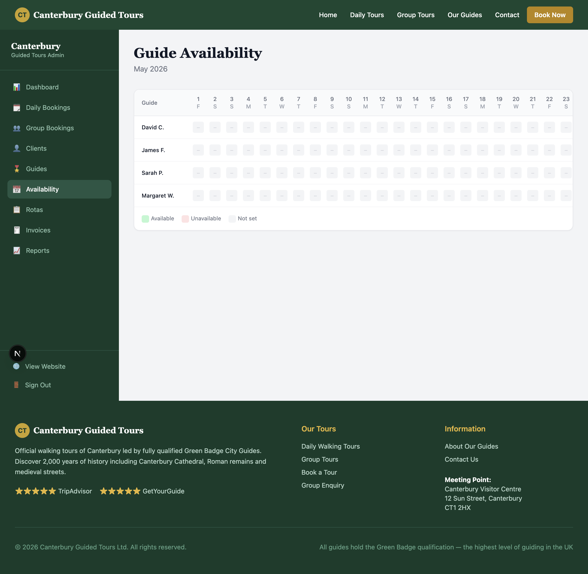

**Features**:
- **Availability Calendar**: Visual calendar showing guide availability
- **Set Availability**:
  - Select guide(s)
  - Mark dates as available/unavailable
  - Add notes (e.g., "available 10am-2pm only")

- **Bulk Updates**: 
  - Mark multiple dates for guide availability
  - Copy availability from previous month
  - Mark annual leave periods

- **Unavailability Reasons**:
  - Annual leave
  - Sick leave
  - Personal time
  - Training/CPD
  - Other commitments

- **View Guide Schedule**: 
  - See all upcoming confirmed tours for each guide
  - Avoid double-booking

**Database Model**:
```
GuideAvailability {
  id: String
  guideId: String (FK)
  guide: Guide (relation)
  date: DateTime
  available: Boolean (default true)
  notes: String?
  createdAt: DateTime
}
```

---

### Rotas Management (`/admin/rotas`)
**Purpose**: Assign guides to specific bookings and time slots


**Features**:
- **Create Rota Entries**:
  - Select guide
  - Select date and time slot
  - Optionally link to DailyBooking
  - Set status (CONFIRMED, STANDBY, CANCELLED)
  - Add internal notes

- **View Rota**:
  - Calendar or table view of all guide assignments
  - See which guide is assigned to which tour
  - Color-coded by tour or status

- **Rota Conflicts**:
  - Prevent double-booking same guide
  - Warn if guide marked unavailable on selected date
  - Show guide availability before assigning

- **Rota Status**:
  - CONFIRMED: Guide confirmed for tour
  - STANDBY: Guide on standby if needed
  - CANCELLED: Assignment cancelled

- **Rota Notes**: Internal communication about special requirements

**Database Model**:
```
RotaEntry {
  id: String
  guideId: String (FK)
  guide: Guide (relation)
  date: DateTime
  timeSlot: String
  dailyBookingId: String? (FK)
  dailyBooking: DailyBooking? (relation)
  status: String (default "CONFIRMED")
  notes: String?
  createdAt: DateTime
}
```

---

### Invoices Management (`/admin/invoices`)
**Purpose**: Generate and track client invoices

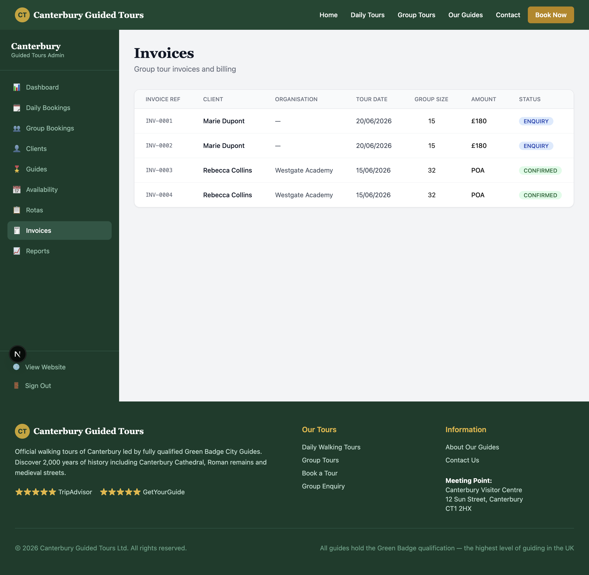

**Features**:
- **Create Invoice**:
  - Select client
  - Select booking(s) to invoice
  - Auto-populate items and prices
  - Add optional discounts
  - Calculate tax (if applicable)
  - Generate invoice number

- **Invoice Template**:
  - Company header with logo
  - Invoice number and date
  - Client details
  - Booking details and pricing
  - Payment terms
  - Notes for client

- **Invoice Status**:
  - DRAFT: Not yet sent
  - SENT: Invoice sent to client
  - PAID: Payment received
  - OVERDUE: Payment not received by due date

- **Payment Tracking**:
  - Record payment date and amount
  - Track partial payments
  - Send payment reminders

- **Invoice History**: View all invoices for each client

---

### Reports & Analytics (`/admin/reports`)
**Purpose**: Business intelligence and performance tracking

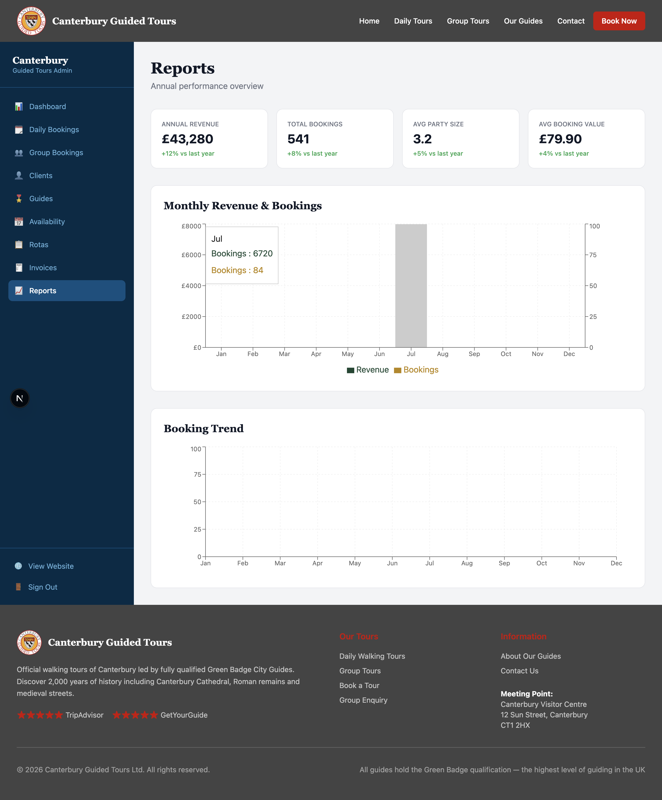

**Charts & Metrics**:
- **Revenue Trends**: Monthly revenue chart
- **Booking Volume**: Daily vs group bookings over time
- **Guide Utilization**: Hours booked per guide
- **Popular Tours**: Most booked tour types
- **Client Acquisition**: New clients per month
- **Seasonal Trends**: Peak and low seasons

**Reports Available**:
- **Revenue Report**: Total revenue, average booking value, growth trends
- **Booking Report**: Total bookings, cancellation rate, repeat customers
- **Guide Performance**: Hours worked, earnings, customer ratings
- **Client Report**: Total clients, repeat rate, lifetime value
- **Export Options**: Download as CSV or PDF

**Dashboard Charts**: Built with Recharts library showing visual trends

---

## 3. Technical Appendices

The sections below are included as implementation reference material. They support technical review and future development planning, but the proposal narrative above should be treated as the primary client-facing summary.

### Appendix A: Database Models and Relationships

#### Entity Relationship Diagram

```
User (Admin accounts)
├── id (Primary Key)
├── email (Unique)
├── password (bcrypt hashed)
├── name
├── role
└── timestamps

Tour (Tour definitions)
├── id (Primary Key)
├── name
├── type (daily, group)
├── description
├── price
├── childPrice
├── maxCapacity
├── meetingPoint
├── includesCathedral
├── isActive
└── timestamps

Client ◄──── DailyBooking
├── id          ├── id
├── firstName   ├── clientId (FK)
├── lastName    ├── tourDate
├── email       ├── timeSlot
├── phone       ├── adults
├── organisation├── children
├── country     ├── totalAmount
├── notes       ├── status
└── timestamps  ├── notes
               └── timestamps

Client ◄──── GroupBooking
            ├── id
            ├── clientId (FK)
            ├── organisation
            ├── groupSize
            ├── preferredDate
            ├── alternativeDate
            ├── tourTheme
            ├── groupType
            ├── requirements
            ├── status
            └── timestamps

Guide ◄──── GuideAvailability
├── id          ├── id
├── firstName   ├── guideId (FK)
├── lastName    ├── date
├── email       ├── available
├── phone       ├── notes
├── bio         └── createdAt
├── badgeNumber
├── isActive
└── timestamps

Guide ◄──── RotaEntry ──────► DailyBooking
           ├── id              (optional relation)
           ├── guideId (FK)
           ├── date
           ├── timeSlot
           ├── dailyBookingId
           ├── status
           ├── notes
           └── createdAt

Guide ◄──── CPDBooking
           ├── id
           ├── guideId (FK)
           ├── title
           ├── provider
           ├── date
           ├── cost
           ├── status
           ├── notes
           └── createdAt

Upsell (Add-on products)
├── id
├── name
├── description
├── price
├── isActive
└── createdAt
```

---

### Appendix B: API Endpoints

#### Public Booking APIs

#### POST `/api/bookings/daily`
**Purpose**: Create a daily tour booking
**Request Body**:
```json
{
  "tourId": "string",
  "tourDate": "2026-05-15",
  "timeSlot": "11:00",
  "adults": 2,
  "children": 1,
  "firstName": "string",
  "lastName": "string",
  "email": "string@example.com",
  "phone": "string",
  "notes": "string (optional)"
}
```
**Response**: `{ bookingId, totalAmount, confirmationNumber }`
**Status Codes**: 201 Created, 400 Bad Request, 500 Server Error

#### POST `/api/bookings/group`
**Purpose**: Create a group tour inquiry
**Request Body**:
```json
{
  "organisation": "string",
  "groupSize": 30,
  "preferredDate": "2026-06-01",
  "alternativeDate": "2026-06-08",
  "tourTheme": "historical",
  "groupType": "school",
  "requirements": "string",
  "firstName": "string",
  "lastName": "string",
  "email": "string@example.com",
  "phone": "string"
}
```
**Response**: `{ inquiryId, confirmationNumber }`

#### GET `/api/guides`
**Purpose**: Fetch all active guides (for About page)
**Response**: Array of Guide objects with `firstName`, `lastName`, `bio`, `badgeNumber`

---

### Appendix C: Authentication and Security

#### NextAuth Configuration
- **Provider**: Credentials (email + password)
- **Session Strategy**: JWT (stateless)
- **Secret**: Stored in `AUTH_SECRET` environment variable
- **Session Duration**: Configurable (default 30 days)

#### Password Security
- Passwords hashed with bcrypt (cost: 10)
- Stored in User model
- Never transmitted in plain text over HTTPS

#### Route Protection
- **Middleware** (`src/middleware.ts`):
  - Protects all `/admin/**` routes
  - Redirects unauthenticated users to `/login`
  - Allows public access to `/login` page

#### CSRF Protection
- NextAuth provides built-in CSRF token handling
- Tokens set in HTTP-only cookies
- Automatic validation on state-changing requests

---

### Appendix D: Technology Stack

#### Frontend
- **Framework**: Next.js 15 (App Router)
- **Language**: TypeScript
- **UI Library**: React 18.3
- **Styling**: Tailwind CSS 3.4
- **Forms**: React Hook Form + Zod validation
- **Charts**: Recharts 2.15

#### Backend
- **Runtime**: Node.js 18+
- **API**: Next.js API Routes
- **ORM**: Prisma 6.6 with TypeScript support
- **Database**: SQLite with libsql adapter
- **Authentication**: NextAuth v5

#### Database
- **Type**: SQLite (local development)
- **Client**: libsql
- **Adapter**: Prisma adapter for libsql
- **Location**: `./dev.db` (local development)

#### Development Tools
- **Linting**: ESLint + Next.js config
- **Styling**: PostCSS + Autoprefixer
- **Build**: Next.js built-in build system
- **Package Manager**: npm

---

### Appendix E: Key Features and Business Logic

#### Booking Price Calculation
```
DailyBooking.totalAmount = (adults × Tour.price) + (children × Tour.childPrice)
```

#### Tour Capacity Management
- Max capacity defined per tour
- Can check available slots: `totalBookings < maxCapacity`
- Optional overbooking logic can be implemented

#### Guide Availability Logic
- Check GuideAvailability for date before assigning rota
- Prevent double-booking same guide on same date/time
- Respect guide preferences (part-time, specific hours)

#### Revenue Calculation
- Dashboard shows: `SUM(DailyBooking.totalAmount)` for revenue
- Can filter by date range for reporting
- Excludes cancelled bookings

#### Client Lifecycle
1. Client submits booking/inquiry form
2. Client record created automatically if new
3. DailyBooking or GroupBooking record created
4. Admin assigns guide via RotaEntry
5. Tour date arrives - guide leads tour
6. Admin creates invoice if needed
7. Client receives follow-up/review request

---

### Appendix F: Future Enhancement Opportunities

#### Potential Features
- Payment processing integration (Stripe, PayPal)
- Email notifications and automated confirmations
- SMS reminders for upcoming tours
- Customer review system
- Dynamic pricing based on demand
- Group discount tiers
- Guide ratings and feedback
- Cancellation policy enforcement
- Waitlist management
- Multi-language support
- Mobile app
- Real-time booking availability widget
- Analytics dashboard with KPIs
- Automated invoice generation and payment reminders

---

### Appendix G: Deployment Considerations

#### Environment Variables
```env
DATABASE_URL=file:./dev.db (development)
AUTH_SECRET=<secure-random-string>
NEXTAUTH_URL=https://yourdomain.com (production)
```

#### Production Database
- Recommend migrating to Turso (hosted libsql)
- Or PostgreSQL with Prisma adapter
- Regular backups essential

#### Security Checklist
- ✓ HTTPS enforced
- ✓ CSRF protection enabled
- ✓ Secure headers configured
- ✓ Input validation on all forms
- ✓ SQL injection prevented (Prisma ORM)
- ✓ XSS protection via React
- ✓ Rate limiting on API endpoints
- ✓ Admin credentials rotated regularly

#### Performance
- CDN for static assets
- Database indexing on frequently queried fields
- Image optimization with Next.js Image
- Code splitting and lazy loading
- Caching strategies for tour information

---

## Closing Summary

Canterbury Guided Tours now has a platform structure that supports both presentation and operations. On the public side, the website positions the business clearly, communicates the value of the tours, and gives visitors direct paths to book or enquire. On the operational side, the admin workspace brings bookings, guide management, scheduling, invoicing, and reporting into one coherent system.

---

*Document Generated: May 4, 2026*
*Version: 1.0*
*System: Canterbury Guided Tours v1.0.0*
